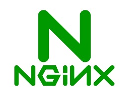
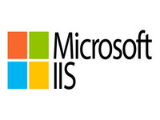

# Deliverable 1 Submission

## Basic Terminology

### What is a web server?
A web server is software that serves web pages and other content over the internet. It receives requests from web clients and delivers web content in response.

### What is Apache?
Apache is an open-source web server software developed by the Apache Software Foundation. It is one of the most widely used web server applications on the internet.
### What are some example web server applications?

| Application Name | license                          | Project's Website                     |
| ---------------- | -------------------------------- | --------------------------------------|
| Apache           | Apache License 2.0               |[example 1](https://httpd.apache.org/) |
| Nginx            | 2-clause BSD License             |[example 2](https://www.nginx.com/)    |
| Microsoft IIS    |  Proprietary                     |[example 3](https://www.iis.net/)      |

#### Example 1
 
Apache is responsible for accepting directory (HTTP) requests from Internet users and sending them their desired information in the form of files and Web pages. Much of the Web's software and code is designed to work along with Apache's features.

#### Example 2
 
NGINX is open-source web server software used for reverse proxy, load balancing, and caching. It provides HTTPS server capabilities and is mainly designed for maximum performance and stability. It also functions as a proxy server for email communications protocols

#### Example 3
 
Internet Information Services (IIS) is a flexible, general-purpose web server from Microsoft that runs on Windows systems to serve requested HTML pages or files. An IIS web server accepts requests from remote client computers and returns the appropriate response.

### What is virtualization?
Virtualization is the process of creating a virtual version of something, such as an operating system, server, storage device, or network resources. It allows multiple virtual instances to run on a single physical machine, enabling more efficient resource utilization.

### What is virtualbox?
 
VirtualBox is a free and open-source virtualization software that allows users to run multiple operating systems on a single physical machine. It supports various guest operating systems, including Windows, Linux, macOS, and more.
### What is a virtual machine?
A virtual machine (VM) is a software emulation of a physical computer that operates like an independent computer system. It runs on a host machine and allows users to run multiple operating systems simultaneously on the same hardware.

### What is Ubuntu Server?
 
Ubuntu Server is a variant of the Ubuntu operating system designed specifically for server environments. It provides a stable and secure platform for hosting web applications, databases, and other server-based services.

### What is a firewall?
A firewall is a network security device or software that monitors and controls incoming and outgoing network traffic based on predetermined security rules. It acts as a barrier between a trusted internal network and untrusted external networks.

### What is SSH?
SSH is a cryptographic network protocol used to securely access and manage remote computers over an unsecured network. It provides encrypted communication between the client and server, allowing users to securely log in to remote systems and execute commands remotely.

## Other Relevant Concepts
  **Secure Shell capabilities**

* Functions that SSH enables include the following:
* secure remote access to SSH-enabled network systems or devices for users, as well as automated processes
* secure and interactive file transfer sessions;
* automated and secured file transfers;
* secure issuance of commands on remote devices or systems; and
* secure management of network infrastructure components.

## Concepts i don't understand:  
 ### What is SSH tunneling?
* SSH tunneling, also known as SSH port forwarding, is a technique that enables a user to open a secure tunnel between a local host and a remote host.