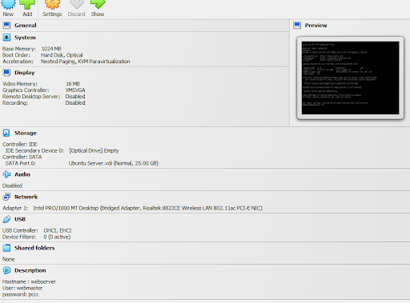
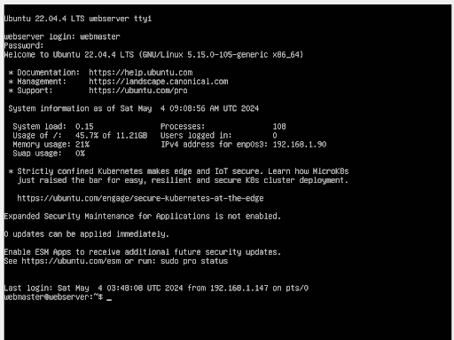

# Deliverable 2:Installing Ubuntu Server And Apache

## Server specifications

## Ubuntu server log in screen?

## What is the IP address of your Ubuntu Server Virtual Machine?
* 192.168.1.90

## How do you enable the Ubuntu Firewall?
* `sudo ufw enable`

## How do you check if the Ubuntu Firewall is running?
* `sudo ufw status`

## How do you disable the Ubuntu Firewall?
* `sudo ufw disable`

## How do you add Apache to the Firewall?
Login to the server amd update the system:
* `sudo apt update; sudo apt upgrade -y`

## What is the command you used to install Apache?
* `sudo apt install apache2 -y`

## What is the command you use to check if Apache is running?
* ` sudo systemctl status apache2`

## What is the command you use to stop Apache?
* ` sudo systemctl stop apache2`

## What is the command you use to restart Apache?
* ` sudo systemctl restart apache2`

## What is the command used to test Apache configuration?
* ` sudo apache2ctl configtest`

## What is the command used to check the installed version of Apache? 
* `apache2 -v`
